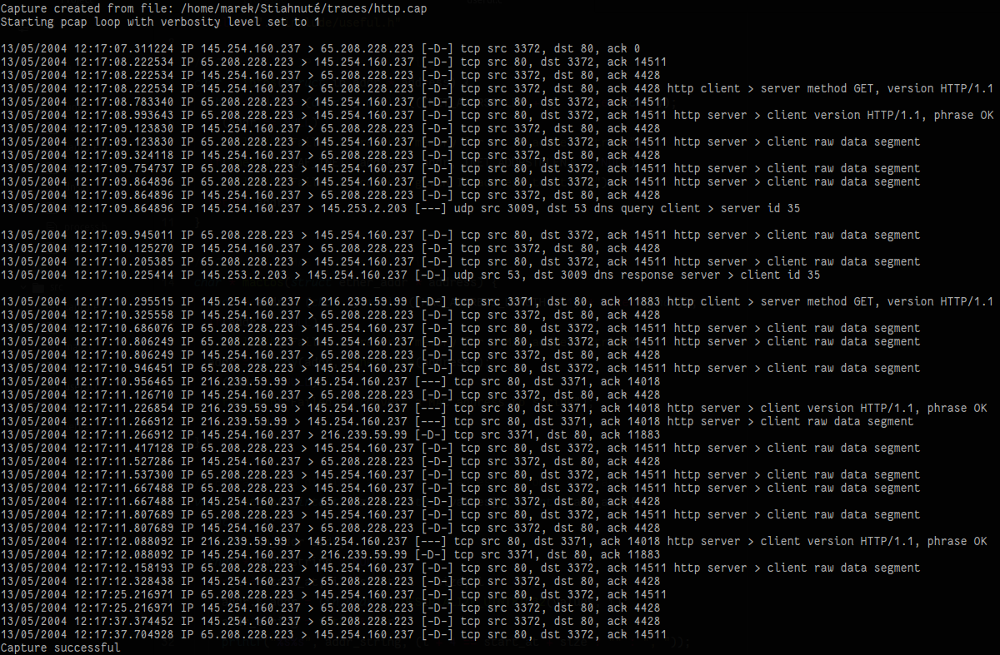
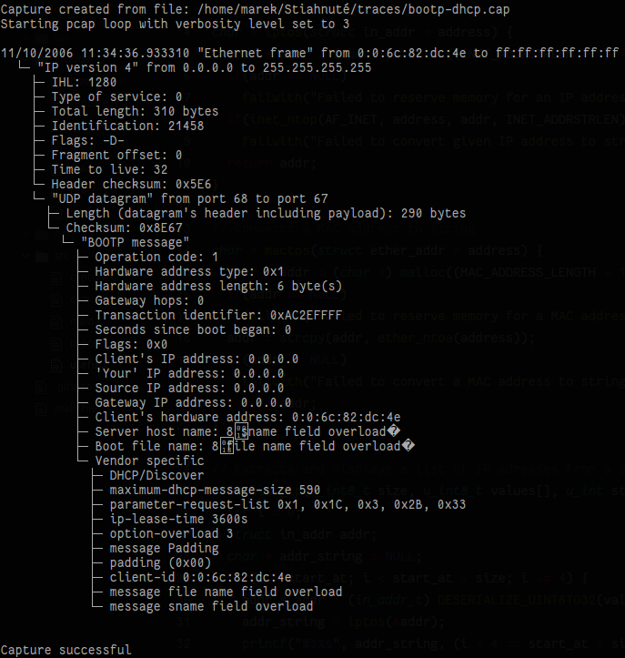

# NaN : Network Analyzer

Projet d'analyseur réseau fonctionnant en ligne de commande réalisé dans le cadre du cours de **Transport et services réseaux** à l'Université de Strasbourg.

## Auteur

> **Marek Felsoci** : étudiant en M1 du Cursus Master en Ingénierie en informatique, systèmes et réseaux

## Protocoles implémentés

Le programme est capable d'extraire des informations des protocoles suivants :

- Ethernet
- IP (v4 et v6)
- ARP
- UDP
- TCP
- BOOTP
- SMTP
- FTP
- POP
- IMAP
- HTTP
- Telnet
- DNS (Le code contient une extension de la fonction d'extraction d'informations mais comme elle présente des irrégularités à certains moments la portion du code qui lui correspond est désactivée par défaut. Il possible de l'activer en mettant la valeur de la macro **__EXTENDED_DNS** définie dans le fichier *include/process.h* à **true**)

## Fonctionnement du programme

### Compilation
Pour pouvoir compiler le programme il faut avoir installé la librairie 'pcap' sur le système. Le paquet correspondant est *libpcap0.8-dev* installable depuis le dépôt de logiciels d'Ubuntu ou autre distribution de Linux.

La compilation en elle-même se fait via le fichier *makefile* présent dans la racine du projet.

Une fois compilé, le binaire *analyzer* est créé dans le dossier *bin*.

### Lancement et options

L'analyseur dispose des options suivantes :

- **-i <interface>** : lancer une capture en temps réel sur une interface valide
- **-o <fichier de capture>** : lancer une capture hors ligne en se basant sur un fichier de capture valide
- **-f <filtre>** : (optionnelle) appliquer un filtre valide à une capture en temps réel
- **-v <niveau>** : définir le niveau de verbosité du programme de 1 à 3 (du moins au plus verbeux)
- **-h** : afficher l'aide

Notez que les options **-i** et **-o** ne peuvent pas être utilisées au même temps !

Voici dans la section suivante des aprçus du programme en utilisant différents niveaux de verbosité.

#### Aperçus

**Verbosité faible**

**Verbosité moyenne**

**Verbosité maximale**

