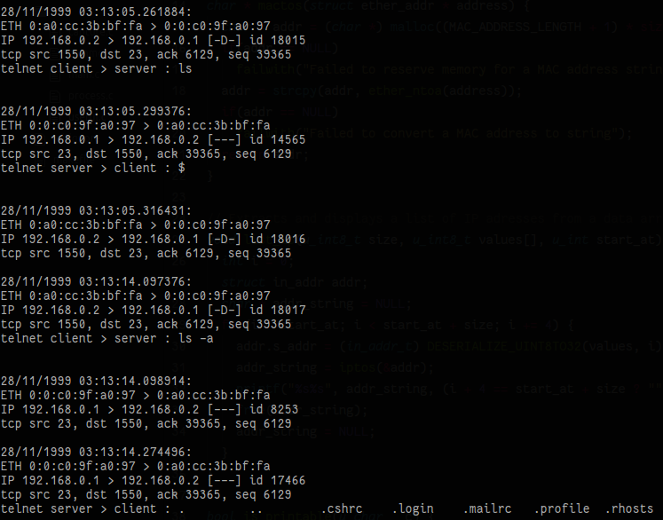

# NaN : Network Analyzer

Command-line network traffic analyzer

## About

Developed as final assignment for our Network transport and services classes at the Universit of Strasbourg, this network traffic analyzer enables one to either capture live traffic from an actual network interface or from a PCAP capture file.

It can provide information on a large variety of network protocols in three different verbosity levels.

## Supported protocols

The application supports extracting information on the following protocols:

- Ethernet
- IP (v4 & v6)
- ARP
- UDP
- TCP
- BOOTP
- SMTP
- FTP
- POP
- IMAP
- HTTP
- Telnet
- DNS

Note that the source code contains contains an extended implementation of information extraction function for the DNS protocol. Nevertheless, this implementation can cause the application to crash in rare cases. Therefore, the corresponding portion of the source code has been deactivated by default. You can enable it for testing purposes by setting value of the macro **__EXTENDED_DNS** defined in file *include/process.h* to **true**.

## Build

In order to be able to build the application from its sources, it is necessary to install the PCAP library on your system. It can be done by firing the following command (for Debian-based Linux distributions only) : `sudo apt install libpcap0.8-dev`. 

Then, build the application using provided *Makefile*.

The binary will be placed into **bin** folder under project's root and will be called **analyzer**.

## Usage

The analyzer provides the following options:

| Option          | Description                                                              |
| --------------- | ------------------------------------------------------------------------ |
| -i `iname`      | launch live capture on the interface called `iname`                      |
| -o `file`       | capture traffic from the specified `file` in offline mode                |
| -f `expression` | apply filter described by the `expression` to a live capture             |
| -v `level`      | define desired verbosity level from 1 (less verbose) to 3 (most verbose) |
| -h              | show help                                                                |

Note that, the **-i** and **-o** options cannot be used simultaneously!

## Screenshots

### Verbosity level 1

### Verbosity level 2

### Verbosity level 3

## Author

[Marek Felsoci](mailto:marek.felsoci@etu.unistra.fr), student at the [University of Strasbourg](http://www.unistra.fr).

## License

This project is licensed uder the terms of the GNU General Public License version 2. See the [LICENSE](LICENSE) file for the full license text.
